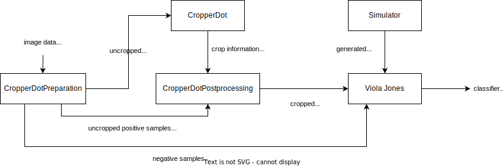

DoubleDotDetector
=================

This project works on the detection of double dots. With given picture data, it creates a classifier that detects double dots within four steps.

CropperDotPreparation
---------------------

First, it generates pictures and CSV files for positive and negative examples. The positive samples will be used in the web application CropperDot again. The negative examples will be saved in the data folder for the Viola-Jones algorithm.

Please enter the following when you want to execute `extract_pictures.py`:

- input path of the npy file
- output path of the npy files
- output path of the png files

CropperDot
----------

The web application CropperDot uses the selected positive examples and shows them to a user, who selects the relevant area of the picture. This step generates JSON files with meta-information for CropperDotPostprocessing

CropperDotPostprocessing
--------------------------

After selecting areas, CropperDotPostprocessing crops the pictures and saves them as positive examples in the data folder for the Viola-Jones algorithm.

Please enter the following when you want to execute `crop_pictures.py`:

- path to the npy files of the pictures
- path to the json files with the crop data
- ouput path for the cropped pictures as npy files
- output path for the cropped pictures as png files if neccesary

Simulation
----------

The simulator generates positive pictures as npy files for the Viola Jones algorithm

Please enter the following when you want to execute `simulation.py`:

- number of positive samples
- output path for the npy files with the picture information
  
Viola-Jones Algorithm
-----------------------

With the positive and negative training examples, this project trains a classifier with AdaBoost to use the Viola-Jones Algorithm.

Please enter the following when you want to execute `simulation.py`:

- path to the positive training data as npy files
- path to the negative training data as npy files
- path to the classfier as pickle file if you want to save or restore a classifier
- path to the positive testing data as npy files of neccesary
- path to the negative testing data as npy files of neccesary

